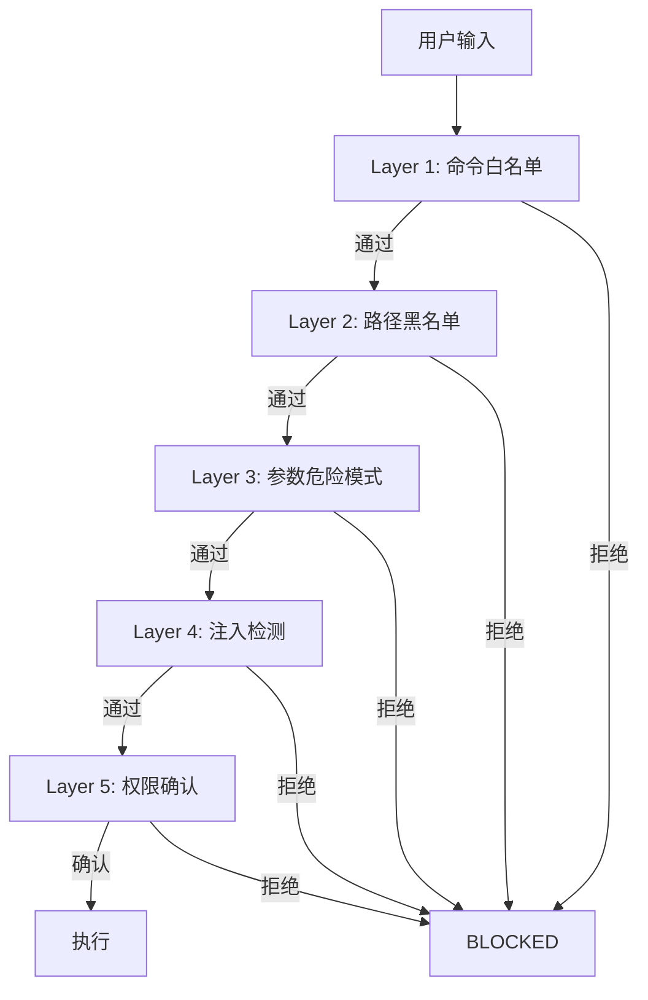

# AI 全栈开发实战教程

## —— 基于 Kiro IDE + Spec-Driven Development 的工程化 AI 辅助开发

---

**适用对象**: 具备基本编程基础的计算机专业学生
**前置知识**: HTML/CSS/JS 基础、任一后端语言基础、Git 基本操作
**教学目标**: 掌握 AI 辅助全栈开发的完整工作流，能独立完成从需求分析到部署交付的全流程

---

# 第一章 AI 全栈开发方法论

## 1.1 从传统开发到 AI 辅助开发

传统软件开发流程（需求分析 -> 设计 -> 编码 -> 测试 -> 部署）中，编码环节占据了开发者 60-70% 的时间。2025-2026 年，以 Claude Code、OpenCode、Cursor 为代表的 AI 编码工具改变了这一比例。

**50-20-30 原则**（2026 年 AI 开发最佳实践）：

| 阶段 | 时间占比 | 核心产出 |
|------|----------|----------|
| 规划（Planning） | 50% | 需求文档、设计文档、任务拆解 |
| 编码（Coding） | 20% | AI 生成 + 人工审查 |
| 验证（Validation） | 30% | 测试、审查、部署验证 |

这意味着：**你的核心竞争力不再是"写代码的速度"，而是"描述清楚要做什么"的能力。**

## 1.2 Spec-Driven Development (SDD)

Spec-Driven Development 是 2026 年被 Thoughtworks、GitHub、Amazon 等组织共同认可的 AI 辅助开发方法论。核心思想：

> **Spec 是源代码的源头，不是事后文档。**

传统流程：需求 -> 代码 -> （可能补）文档
SDD 流程：**需求文档 -> 设计文档 -> 任务文档 -> AI 生成代码 -> 验证**

三份核心文档构成 Spec：
1. **Requirements（需求规格）** — 定义"做什么"
2. **Design（技术设计）** — 定义"怎么做"
3. **Tasks（实现任务）** — 定义"分几步做"

## 1.3 工具选型：Kiro IDE

Kiro 是 AWS 推出的 AI 开发环境，原生支持 SDD 工作流：

| 功能 | 作用 |
|------|------|
| Spec 模式 | 引导你写 Requirements -> Design -> Tasks 三份文档 |
| Steering 文件 | 给 AI 的项目级持久化约束（如 API 契约、编码规范） |
| Skills | AI 的"角色扮演"能力包（如代码审查员、架构师） |
| Hooks | IDE 事件触发的自动化（如保存时 lint、提交前测试） |
| Powers | MCP 协议集成的外部工具能力 |

---

# 第二章 开发环境搭建

## 2.1 安装 Kiro IDE

前往 https://kiro.dev 下载适合你操作系统的版本。

安装后打开工作区，Kiro 会自动创建 `.kiro/` 目录：

```
.kiro/
  settings/     # IDE 设置（MCP 配置等）
  specs/        # Spec 文档（按功能模块分目录）
  steering/     # AI 行为约束文件
  skills/       # 已安装的 AI Skill
```

## 2.2 工作区结构说明

一个典型的 AI 辅助开发项目结构：

```
my-project/
  .kiro/
    specs/
      feature-a/
        requirements.md    # 需求文档
        design.md          # 设计文档
        tasks.md           # 任务拆解
      feature-b/
        ...
    steering/
      api-contract.md      # API 契约（前后端约定）
      coding-standards.md  # 编码规范
    skills/
      my-skill/
        SKILL.md           # Skill 定义
        references/        # 参考资料
  src/                     # 源代码
  web/                     # 前端代码
  docs/                    # 文档
```

## 2.3 配置 MCP Server

MCP (Model Context Protocol) 允许 AI 连接外部工具。在 `.kiro/settings/mcp.json` 中配置：

```json
{
  "mcpServers": {
    "context7": {
      "command": "npx",
      "args": ["-y", "@upstash/context7-mcp@latest"],
      "env": {},
      "disabled": false
    }
  }
}
```

## 2.4 安装 Skill

Skill 是 AI 的行为规范包。例如安装"纪律工程师"Skill 后，AI 会：
- 自动判断用户意图（写代码 or 审查代码）
- 写代码前先读已有代码
- 每次改动后验证构建通过
- 按严格度等级调整代码质量要求

---

# 第三章 编写需求规格文档（Requirements）

## 3.1 为什么先写需求

> "如果你不知道要去哪里，任何路都不会把你带到那里。"

AI 写代码的质量直接取决于你描述需求的质量。一个模糊的 prompt 只能得到模糊的代码；一份结构化的需求文档能让 AI 持续产出高质量、一致的代码。

## 3.2 需求文档的结构

```markdown
# Requirements Document

## Introduction
> 项目背景、目标、约束

## Glossary
> 术语定义表（消除歧义）

## Requirements
### Functional Requirements (MUST)
> 必须实现的功能，用"系统应..."描述

### Nice-to-have (SHOULD)
> 加分项

### Non-Functional Requirements
> 性能、安全、可用性约束

## Acceptance Criteria
> 验收标准（可测试的条件）
```

## 3.3 实战示例

以我们的"Linux 运维智能体"项目为例，从赛题描述提炼需求：

**赛题原文（摘要）**：
> 开发一套部署于操作系统的智能运维 Agent...通过实现 MCP 协议...安全护栏架构...

**提炼后的 Requirements 片段**：

```markdown
### FR-1: 自然语言运维交互
系统应接受自然语言形式的运维指令，通过 LLM 理解意图后调用对应工具执行。

验收标准：
- 输入"看看磁盘"，系统调用 df 命令并返回结构化结果
- 输入"重启 nginx"，系统识别为写操作并请求用户确认

### FR-2: 安全护栏
系统应对所有命令执行五层安全校验：
1. 命令白名单匹配
2. 路径黑名单检查
3. 参数危险模式正则
4. 提示词注入检测
5. 写操作权限确认
```

## 3.4 与 AI 协作写需求的技巧

在 Kiro 中新建 Spec 时，选择 "Requirements First" 工作流。AI 会引导你：

1. 描述项目目标
2. AI 提问细化（"目标用户是谁？""性能要求？"）
3. AI 生成初稿
4. 你修订并确认

**关键提示词模板**：
```
我要做一个 [项目类型]，目标是 [核心目标]。
约束条件：[平台/技术/时间限制]。
请帮我写 requirements.md，包含：功能需求、非功能需求、验收标准。
```

---

# 第四章 编写技术设计文档（Design）

## 4.1 Design 文档的职责

Design 文档回答：**怎么做？**

它包含：
- 系统架构（分层、模块划分）
- 数据模型（数据库 schema）
- API 契约（接口定义）
- 技术选型决策（为什么选 Go 不选 Python）
- 安全设计

## 4.2 从需求到设计

需求说"要安全校验"，设计说"用五层流水线、每层独立模块、规则从配置文件加载"。

```markdown
## Architecture

### 安全校验流水线



### 数据模型

| 表 | 用途 |
|---|------|
| sessions | 对话会话 |
| messages | 消息历史 |
| audit_logs | 审计日志（五段式） |
| configs | 系统配置 |
| mcp_servers | MCP 插件配置 |
```

## 4.3 技术选型决策的记录方式

用 ADR (Architecture Decision Record) 格式：

```markdown
### 决策：后端语言选择 Go

**背景**: 需要交叉编译到 LoongArch64，且无外部运行时依赖
**选项**:
- Go: CGO_ENABLED=0 纯静态编译，单二进制
- Python: 需要 Python 运行时，loong64 支持不确定
- Rust: 编译时间长，团队不熟悉

**决定**: Go
**理由**: 零依赖单二进制 + loong64 原生支持 + 团队有经验
```

---

# 第五章 编写实现任务（Tasks）

## 5.1 Tasks 文档的结构

```markdown
# Implementation Plan

## Tasks

- [ ] 1. 任务名称
  - [ ] 1.1 子任务（可验证的原子步骤）
  - [ ] 1.2 子任务
  - [ ] 1.3 测试: 验证条件

## Task Dependency Graph
（哪些任务可以并行，哪些有依赖）
```

## 5.2 Task 粒度把控

好的 Task 特征：
- **原子性**：一次 commit 能完成
- **可验证**：有明确的通过条件
- **独立性**：尽量不依赖其他未完成的 Task

坏的 Task 示例：
```
- [ ] 实现前端  ← 太大，不知道什么时候算完
```

好的 Task 示例：
```
- [ ] 13.5 复原中间对话流: 行布局消息 + Markdown渲染 + 工具调用折叠块
  测试: 发送消息后能看到 agent 回复（Markdown 正确渲染）
```

## 5.3 依赖波次（Waves）

将 Tasks 按依赖关系分成波次，每个波次内的 Tasks 可以并行：

```
Wave 1: 环境验证（项目初始化、编译验证）
Wave 2: 后端核心（安全校验、工具实现、Agent Loop）
Wave 3: 前端 + 多 Agent
Wave 4: 打磨 + 部署
Wave 5: 交付（文档、视频、E2E 测试）
```

---

# 第六章 Steering（AI 行为约束）

## 6.1 什么是 Steering

Steering 文件是放在 `.kiro/steering/` 目录下的 Markdown 文件，每次 AI 处理请求时都会自动加载（或按条件加载）。

它的作用是**持久化约束**——你不需要每次对话都重复"前端用 inline style、图标用 Material Symbols"。

## 6.2 三种加载模式

```yaml
---
inclusion: always    # 每次对话自动加载（默认）
---

---
inclusion: manual    # 用户手动用 # 引用时才加载
---

---
inclusion: fileMatch
fileMatchPattern: "*.tsx"  # 当读取 tsx 文件时自动加载
---
```

## 6.3 实战：前后端契约文件

```markdown
---
inclusion: manual
---
# 前后端对接契约

## 铁律
1. 零假数据 — 前端不硬编码任何数字
2. 数据源注释 — 每个组件标注 `// Data: GET /xxx`
3. 本文件跟着改 — 后端改接口时同步更新

## API 状态表
| 端点 | 方法 | 状态 |
|------|------|------|
| /health | GET | 已就绪 |
| /api/v1/chat/stream | POST | 已就绪 |
```

当你告诉 AI "参考 #前后端契约 来写这个组件"时，AI 就知道该调哪个接口、不该编造数据。

---

# 第七章 Skills（AI 角色规范）

## 7.1 Skill 的结构

```
.kiro/skills/my-skill/
  SKILL.md           # 主文件：角色定义 + 行为规则
  references/        # 参考资料（原则、检查表等）
    clean-code.md
    pragmatic-programmer.md
```

## 7.2 实战：纪律工程师 Skill

这个 Skill 让 AI 在写代码时遵守工程纪律：

```markdown
# 纪律工程师

## 角色推断
- 用户说"实现/写/创建" → Builder 模式（产出代码）
- 用户说"审查/检查/review" → Reviewer 模式（评估代码）

## 铁律
1. 先读后写：修改前必须先读目标文件
2. 单一真相源：不重复硬编码
3. 验证不假设：改完必须 go build / tsc --noEmit

## Builder 模式检查清单
□ 读了目标文件现有代码
□ 识别了项目约定
□ 构建通过，零警告
```

## 7.3 触发方式

在 Kiro 中，通过 `/skill-name` 触发：
```
/disciplined-engineer 帮我实现用户登录功能
```

AI 会自动加载 Skill 内容，按角色行事。

---

# 第八章 Hooks（自动化工作流）

## 8.1 Hook 的事件类型

| 事件 | 触发时机 |
|------|----------|
| fileEdited | 用户保存文件时 |
| fileCreated | 新建文件时 |
| preToolUse | AI 调用工具前 |
| postToolUse | AI 调用工具后 |
| preTaskExecution | Spec Task 开始前 |
| postTaskExecution | Spec Task 完成后 |
| promptSubmit | 用户发送消息时 |

## 8.2 实战示例

**保存 TypeScript 文件时自动类型检查：**
```json
{
  "name": "TypeCheck on Save",
  "version": "1.0.0",
  "when": {
    "type": "fileEdited",
    "patterns": ["*.ts", "*.tsx"]
  },
  "then": {
    "type": "runCommand",
    "command": "npx tsc --noEmit"
  }
}
```

**AI 写文件前审查安全性：**
```json
{
  "name": "Review Write Safety",
  "version": "1.0.0",
  "when": {
    "type": "preToolUse",
    "toolTypes": ["write"]
  },
  "then": {
    "type": "askAgent",
    "prompt": "检查这次写操作是否符合编码规范"
  }
}
```

---

# 第九章 前端设计稿到代码

## 9.1 设计系统约定

在项目开始前，通过 Steering 文件固定前端约定：
- **样式**: 全部 inline style（不用 CSS class）
- **图标**: Material Symbols Outlined
- **字体**: CSS 变量（`--ops-font-ui`, `--ops-font-mono`）
- **颜色**: CSS 变量（`--ops-fg-primary`, `--ops-status-danger`）

## 9.2 从设计稿到组件的 Prompt 策略

```
参考这个设计稿截图，实现 AppHeader 组件。
约束：
- React + TypeScript
- 全部 inline style
- 图标用 Material Symbols Outlined (className="material-symbols-outlined")
- 响应式设计变量用 var(--ops-xxx)
```

## 9.3 组件拆分原则

每个组件头部标注数据来源：
```tsx
// Data: GET /health (连接状态)
import { type FC } from 'react'

export const AppHeader: FC<Props> = ({ ... }) => {
  // ...
}
```

---

# 第十章 后端实现与 AI 协作

## 10.1 Go 项目标准结构

```
cmd/
  server/main.go       # 入口
internal/
  agent/               # Agent 核心逻辑
  api/                 # HTTP handlers
  config/              # 配置加载
  llm/                 # LLM 客户端
  mcp/                 # MCP 协议客户端
  safety/              # 安全校验
  store/               # 数据持久化
  tools/               # 工具注册表
```

## 10.2 与 AI 协作编码的铁律

1. **每步验证**: AI 改完代码后立即 `go build ./...`
2. **先读后写**: AI 修改文件前必须先 `read_file`
3. **匹配现有模式**: 新代码要跟项目风格一致
4. **不过度生成**: AI 倾向于多做，你要约束范围

## 10.3 错误诊断策略

当 AI 的修改导致编译错误时：
```
编译报错了：
[粘贴错误信息]

请修复，注意不要改其他不相关的文件。
```

当同一个方法失败两次时：
```
这个方法已经失败两次了。
不要继续微调，分析根因，提出一个完全不同的方案。
```

---

# 第十一章 部署与交付

## 11.1 交叉编译

Go 的交叉编译零配置：
```bash
GOOS=linux GOARCH=amd64 CGO_ENABLED=0 go build -o server ./cmd/server
```

关键：`CGO_ENABLED=0` 确保纯静态链接，部署时不需要任何运行时依赖。

## 11.2 一键部署脚本设计

好的部署脚本应该：
- 交互式引导用户填写配置
- 检查环境前置条件
- 给出清晰的错误提示
- 一条命令启动

## 11.3 前端静态文件内嵌

生产模式下，后端直接 serve 前端的构建产物（`web/dist/`），这样部署时只需要一个二进制 + 一个 web 目录。

---

# 第十二章 课程总结与最佳实践

## 12.1 AI 全栈开发的核心流程

```
1. 写 Spec（需求 → 设计 → 任务）     ← 50% 时间
2. 配 Steering + Skill（约束 AI 行为）
3. 按 Task 逐步让 AI 实现              ← 20% 时间
4. 每步验证（build + test + review）   ← 30% 时间
5. 部署交付
```

## 12.2 常见陷阱

| 陷阱 | 后果 | 正确做法 |
|------|------|----------|
| 不写 Spec 直接让 AI 写代码 | 代码零散、不一致 | 先花时间写清楚需求 |
| 不验证 AI 的产出 | 累积隐性 bug | 每次改动都 build + test |
| 一次给 AI 太大的任务 | 输出质量下降 | 拆成原子任务逐步做 |
| 不读 AI 改了什么 | 不知道系统怎么工作了 | 至少审查关键文件 |
| 不配 Steering | AI 每次对话都重头猜约定 | 固定约定写入 Steering |

## 12.3 技能检查表

完成本教程后，你应该能：
- [ ] 为一个新项目编写完整的 Spec（三份文档）
- [ ] 配置 Steering 约束 AI 行为
- [ ] 安装和定制 Skill
- [ ] 设置 Hook 自动化工作流
- [ ] 引导 AI 逐步实现 Task
- [ ] 验证每步产出（build/test）
- [ ] 打包部署到目标环境

---

# 附录

## A. 推荐阅读

- Spec-Driven Development: https://augmentcode.com/guides/what-is-spec-driven-development
- Kiro 官方文档: https://kiro.dev/docs
- The Pragmatic Programmer (2nd Ed.)
- Clean Code

## B. 本教程配套项目

项目地址: ops-agent (Linux 运维智能体)
技术栈: Go + chi + SQLite + React 19 + TypeScript + Vite

该项目完整展示了从 Spec 到代码的全流程，包含：
- 5 个 Spec 模块（linux-ops-agent, permission-system, chat-message-rendering, backend-restructure, agent-loop-refactor）
- 1 个 Steering 文件（前后端 API 契约）
- 1 个 Skill（纪律工程师 v2）
- 23 个 MCP 工具
- 完整的前后端实现
